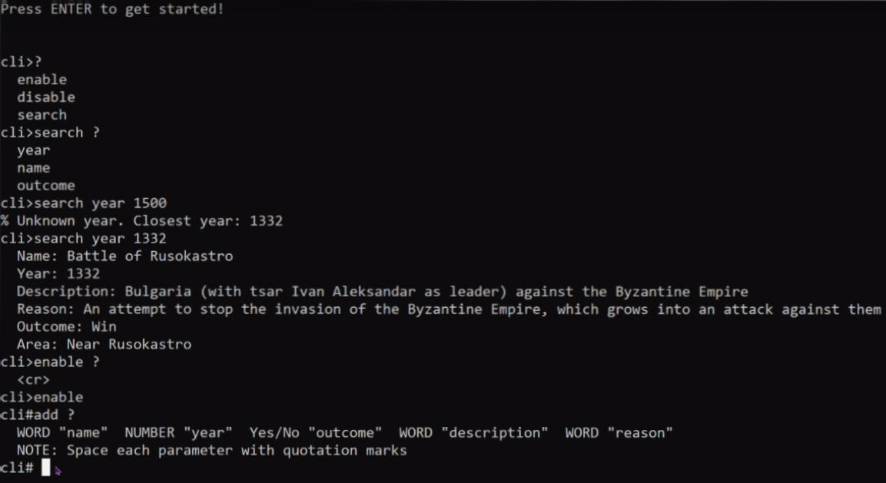

  

## Table of content 📃

* [About](#About)

* [Used for creation](#Used-for-creation)

* [Team](#Team)

* [Preview](#Preview)

## About❓

Our project contains a program with **Cisco-style command line interface about Bulgaria's most significant battles.**

## Used for creation🔧

* *Visual studio* - for the code

* *Visual studio code* - for sorting the code and creating the README

* *GitHub* - for commiting the project and sharing it

* *Photoshop* - for creating the logo 

* *Word and PowerPoint* - for creating the documentation and presentation

* *ArcGis* - for creating the maps

* *Teams* - for comunication

## Team👋

* **Kalin Chervenkov** - backend developer - <KSChervenkov19@codingburgas.bg>

* **Tereza Opanska** - frontend developer - <TNOpanska@codingburgas.bg>

* **Dobrin Peychev** - scrum trainer - <DIPeychev19@codingburgas.bg>

* **Nikolai Brankov** - QA engineer - <NPBrankov19@codingburgas.bg>

## Preview👩‍💻

  

