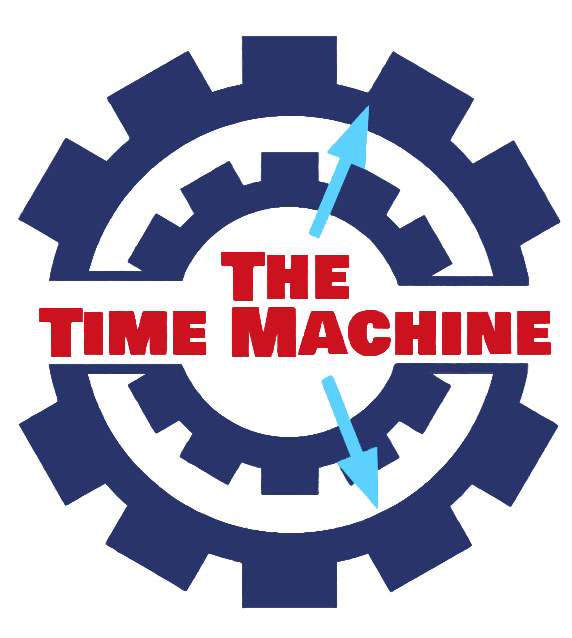

# TheTimeMachine

## Table of content

* About

* Used for creation

* Team

* Preview

## About

## Used for creation

* Visual studio - for the code

* Visual studio code - for sorting the code and creating README

* Git hub - commiting the project ad sharing it

* Photoshop - for creating logo and images 

* Word and PowerPoint - for creating documentation and presentation

* Discord - comunication

## Team

* Kalin Chervenkov - backend developer - <KSChervenkov19@codingburgas.bg>

* Tereza Opanska - frontend developer - <TNOpanska@codingburgas.bg>

* Dobrin Peychev - scrum trainer - <DIPeychev19@codingburgas.bg>

* Nikolai Brankov - QA engineer - <NPBrankov19@codingburgas.bg>

## Preview

